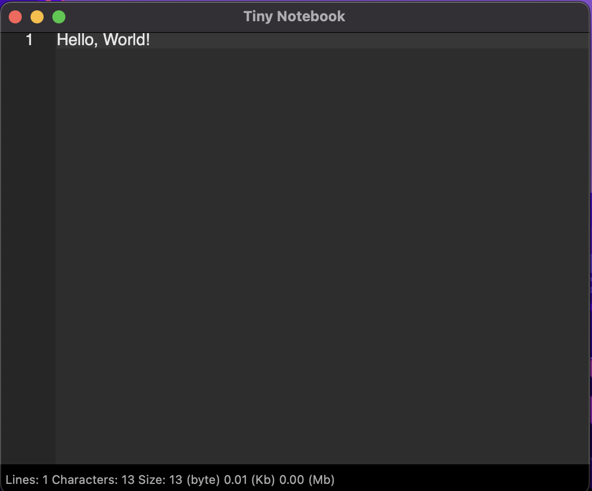

# Tiny Notebook

The minimal notebook for macOS, nothing fancy at all.
The normal open, save, change font etc.

Lines, bytes and characters are visible in the statusbar.

Written in C++ and wxWidgets.

